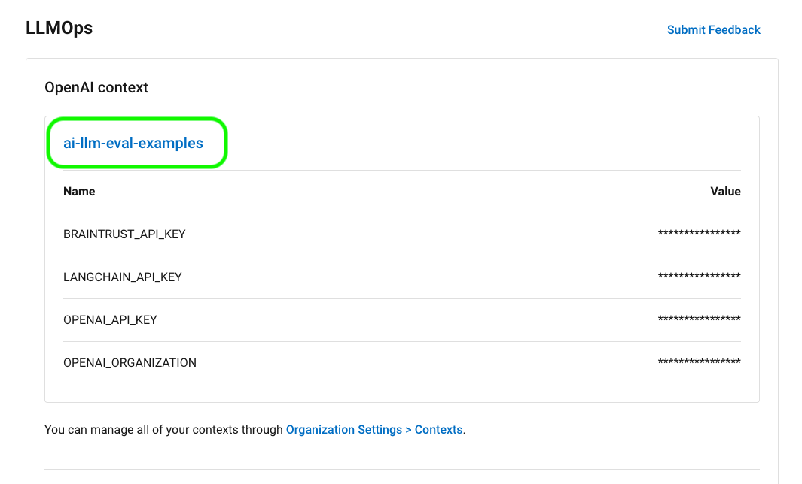

# evals orb

[](https://circleci.com/gh/CircleCI-Public/evals-orb) [](https://circleci.com/orbs/registry/orb/circleci/evals) [](https://raw.githubusercontent.com/circleci-public/evals-orb/main/LICENSE) [](https://discuss.circleci.com/c/ecosystem/orbs)

This repository has the code for the [CircleCI Evals Orb](https://circleci.com/developer/orbs/orb/circleci/evals).

The Evals orb simplifies the definition and execution of evaluation jobs using popular third-party tools, and generates reports of evaluation results.

Given the volatile nature of evaluations, evaluations orchestrated through this orb do not halt the pipeline if an evaluation fails. This approach ensures that the inherent flakiness of evaluations does not disrupt the development cycle.
Instead, a summary of the evaluation results is created and presented:

- As an artifact within the CircleCI User Interface:

  

- As a comment on the corresponding GitHub pull request **(only available for GitHub projects integrated through OAuth)**:

  

## Usage

### Getting Started

#### Enter your OpenAI, LangSmith, and/or BrainTrust credentials into CircleCI

Just navigate to `Project Settings` > `LLMOps` and fill out the form by Clicking `Set up Integration`.


This will create a context with environment variables for the credentials you've set up above.

:warning: _Please take note of the generated context name (e.g. `ai-llm-eval-examples`). This will be used to update `context` value in the CircleCI configuration file._



:bulb: _You can also optionally [store a `GITHUB_TOKEN`](#to-enable-the-evals-orb-to-post-eval-job-summaries-on-github-pull-requests) as an environment variable on this context, if you'd like your pipelines to post summarized eval job results as comments on GitHub pull requests._

#### Set up the orb to post eval job summaries as comments on GitHub pull requests

> [!WARNING]
> Currently, this feature is available only to GitHub projects integrated through OAuth. To find out which GitHub account type you have, refer to the [GitHub OAuth integration](https://circleci.com/docs/github-integration/) page of our Docs.

In order to post comments to GitHub pull requests, you will need to create an environment variable named `GITHUB_TOKEN` with a [GitHub Personal Access Token](https://docs.github.com/en/authentication/keeping-your-account-and-data-secure/managing-your-personal-access-tokens) that has repo scope access.

Once created, add `GITHUB_TOKEN` as a context environment variable on the same context you created as part of LLMOps Integration via `Project Settings` > `LLMOps`.

You can also access this context via `Organization Settings` > `Contexts`.

You will then need to ensure [you add the context key to the job that requires access to it](https://circleci.com/docs/contexts/#create-and-use-a-context), as follows...

```yml
# WORKFLOWS
workflows:
  braintrust-evals:
    when: << pipeline.parameters.run-braintrust-evals >>
    jobs:
      - run-braintrust-evals:
          context:
            - ai-llm-eval-examples # Replace this with your context name
  langsmith-evals:
    when: << pipeline.parameters.run-langsmith-evals >>
    jobs:
      - run-langsmith-evals:
          context:
            - ai-llm-eval-examples # Replace this with your context name
```

### Orb Parameters

The [evals orb](https://github.com/circleci-public/evals-orb) accepts the following parameters:

_Some of the parameters are optional based on the eval platform being used._

#### Common parameters

- **`circle_pipeline_id`**: CircleCI Pipeline ID

- **`cmd`**: Command to run the evaluation

- **`eval_platform`**: Evaluation platform (e.g. `braintrust`, `langsmith` etc.; default: `braintrust`)

- **`evals_result_location`**: Location to save evaluation results (default: `./results`)

#### Braintrust-specific parameters

- **`braintrust_experiment_name`** _(optional)_: Braintrust experiment name
  - If no value is provided, an experiment name will be auto-generated based on an MD5 hash of `<CIRCLE_PIPELINE_ID>_<CIRCLE_WORKFLOW_ID>`.

#### LangSmith-specific parameters

- **`langsmith_endpoint`** _(optional)_: LangSmith API endpoint (default: `https://api.smith.langchain.com`)

- **`langsmith_experiment_name`** _(optional)_: LangSmith experiment name
  - If no value is provided, an experiment name will be auto-generated based on an MD5 hash of `<CIRCLE_PIPELINE_ID>_<CIRCLE_WORKFLOW_ID>`.

### Use in Config

For full config usage guidelines, see the [evals orb](http://circleci.com/orbs/registry/orb/circleci/evals) documentation.

## Usage Examples

For [evals orb](https://circleci.com/developer/orbs/orb/circleci/evals) usage examples, check out the [llm-eval-examples](https://github.com/CircleCI-Public/llm-eval-examples) repo.

## FAQ

View the [FAQ in the wiki](https://github.com/CircleCI-Public/evals-orb/wiki/FAQ)

## Contributing

We welcome [issues](https://github.com/CircleCI-Public/evals-orb/issues) to and [pull requests](https://github.com/CircleCI-Public/evals-orb/pulls) against this repository!

For further questions/comments about this or other orbs, visit the [CircleCI Orbs discussion forum](https://discuss.circleci.com/c/orbs).
